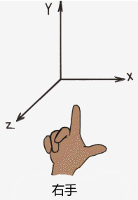

# WebGL (web graohics library)

- 本质
    - JavaScript API
    - 基于 Canvas 画布进行绘制

- 作用

    - 在浏览器中渲染交互式的 3D 图形 （兼容的）(无需插件)

    - 使开发者可以利用 GPU 加速处理，在网页上实现复杂图形效果

- 特点

  - 基于 OpenGL ES 2.0 (免费的跨平台 3D 图形 API 接口 | 嵌入式设备 | 移动设备)

- 应用场景

  - 网页上开发高性能 3D 游戏

## WebGL 坐标系

- 右手坐标系

- X,Y,Z 轴正方向最大值为 1 ，负方向最大值为 -1

## Canvas 坐标系

> Canvas 画布 支持 2D 与 3D 坐标系

- 2D 坐标轴
    - 坐标原点：画布左顶点
    - x轴：水平方向向右
    - y轴：垂直方向向下 

- 3D 坐标轴
    - 坐标原点：画布中心
    - x轴：水平方向
    - y轴：垂直方向
    - z轴：屏幕朝外方向

## WebGL 渲染管线

- 定义
  - 将 3D 场景转换为 2D 图像，最终在屏幕上显示出来的总过程
- 组成
  - 顶点处理
    - 顶点着色器处理每个顶点的数据，将顶点坐标从对象空间转换到裁剪空间
  - 图元装配
    - 顶点被组合成图元（例如三角形/线段/点）。WebGL支持的基本图元类型包括点/线段和三角形
  - 光栅化
    - 将图元转换为片段（fragments）,每个片段对应一个屏幕像素。光栅化过程确定哪些像素被图元覆盖，并生成这些片段的插值属性（如颜色/深度/纹理坐标）。
  - 片段处理
    - 片段着色器对每个片段执行操作，确定其最终颜色。片段着色器确定其最终颜色。片段着色器可以执行光照计算/纹理采样和颜色混合等操作
  - 测试阶段
    - 深度测试
      - 确定片段是否在当前帧缓冲区的深度范围内，以决定是否绘制该片段
    - 模板测试
      - 使用模板缓冲区进行进一步的片段筛选。
  - 融合阶段
    - 将片段颜色与帧缓冲区中已有颜色混合，以实现透明效果等。
  - 帧缓冲操作
    - 最终的片段颜色被写入帧缓冲区，准备显示在屏幕上。帧缓冲区是一个存储颜色/深度和模板信息的内存区域